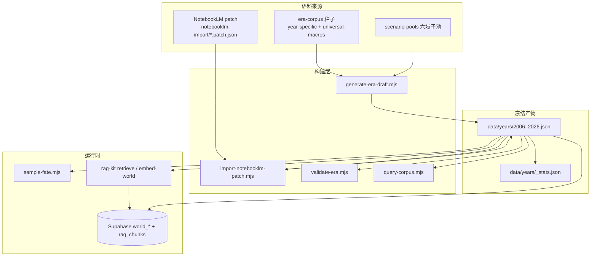

# World 语料库架构

Shadow **命运 Agent** 的数据层：2006–2026 中国大陆真实时代背景，供 `sampleFateContext()` 按六域权重抽样。

## 数据流总览



## 三层语料

| 层 | 字段 | 用途 |
|----|------|------|
| **宏观** | `macro_events[]` | 真实大事件，带 `source_url` |
| **微观** | `micro_events[]` | 个人际遇，带 `scenario`（六域）、`can_pivot` |
| **氛围** | `summary`, `social_mood`, `atmosphere`, `pop_culture` | Year prompt 时代线 |

NotebookLM 合并后额外字段：`notebooklm_summary`, `notebooklm_social_mood`, `notebooklm_gaps`, `notebooklm_imported_at`（不覆盖含大陆统计的 base 叙事）。

## 命令速查

```bash
cd shadow-corpus/world

npm run generate          # 默认 skip NotebookLM 年；见 ADR-001
npm run generate -- --regen-pools   # 安全：仅追加子池 micro
npm run import-notebooklm # patch → fuzzy 合并去重
npm run validate          # schema + 量级 + 六域≥30
npm run query -- --q 疫情 --year 2020
npm run query -- --status
npm run audit-duplicates  # 近重复审计
npm run sync-rag -- --dry-run       # validate + chunk 统计
npm run seed              # JSON → Supabase

# 向量检索（需 DASHSCOPE + Supabase）
cd ../packages/rag-kit && npm run query -- "疫情封城" --world --year 2020
```

## generate / import（ADR-001）

详见 [`docs/adr/001-world-corpus-pipeline.md`](../../docs/adr/001-world-corpus-pipeline.md)。

| 场景 | 命令 |
|------|------|
| 扩子池 | `generate -- --regen-pools` |
| NotebookLM patch | `import-notebooklm` → `validate` → `sync-rag` |
| 改种子（破坏性） | `generate -- --year Y --force` → 再 import |

## 检索两层

| 层 | 工具 | 依赖 | 场景 |
|----|------|------|------|
| **L1 结构化** | `query-corpus.mjs` / `corpus-retrieval.searchCorpus` | 无 | Agent 抽检、去重查重 |
| **L2 规则** | `corpus-retrieval.refinePoolForFate` | 无 | sampleFateContext retrieval=rules |
| **L3 语义** | `packages/rag-kit` | DashScope + Supabase | hybrid vector retrieve |

L1 直接扫 JSON；L2 由 `chunk-world.mjs` 切 chunk → `embed-world.mjs` 写入 `rag_chunks`，与 `world_*` 业务表并行。

## 与命运 Agent 的接缝

```
profile + persona + narrative_year
    → computeFateWeights()     # lib/fate-weights.mjs
    → loadYearPack(calendar_year)  # corpus-retrieval.mjs
    → preparePoolForSampling(retrieval='rules'|'none')
    → weightedSample(macro/micro)
    → FateContext → Year agent prompt
```

契约见 `skills/shadow/fate-agent/reference.md` 与 `02-technical-design/04-scenario-weight-system.md`。

## 相关 Skill

| 任务 | Skill |
|------|-------|
| 语料 / 权重 / seed | `fate-agent` |
| NotebookLM 合并流程 | `world/notebooklm/00-如何使用.md` |
| RAG / embed | `02-technical-design/05-rag-system.md` |
| 架构深化评审 | `improve-codebase-architecture` |
| 写 ADR | `documentation-and-adrs` |
| Context 分层 | `context-engineering` |

## 已知改进点（待 ADR）

1. ~~**generate vs import**~~ → ADR-001：`--regen-pools` / skip notebooklm / `--force`
2. ~~**去重**~~ → `lib/dedupe.mjs` + `audit-duplicates`
3. ~~**RAG embed**~~ → `npm run sync-rag`
4. ~~**统一检索 seam**~~ → `lib/corpus-retrieval.mjs`

待办：cross-year 宏观去重；`--force` 后自动 replay patches。
