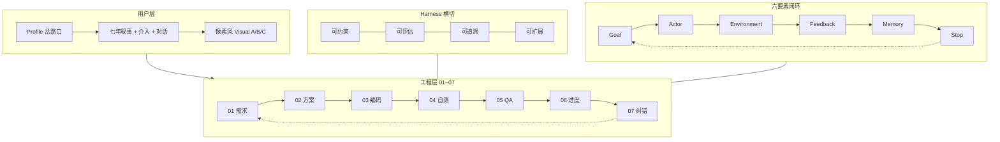
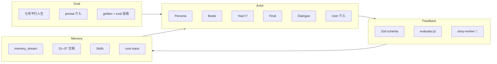
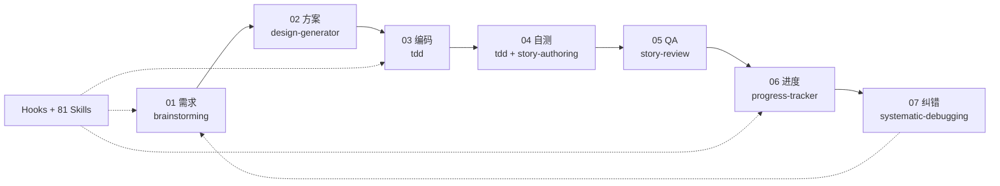
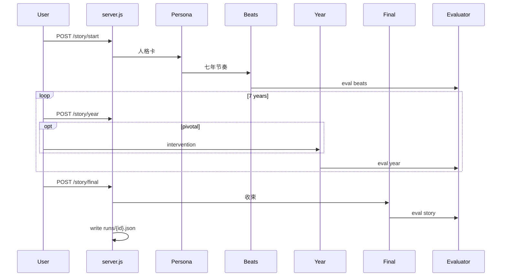
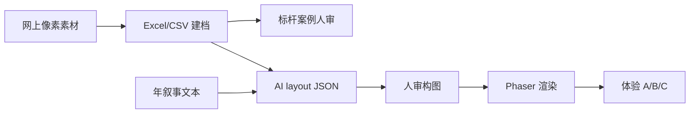

# Shadow Harness 框架示意图

更新时间：2026-06-14

> **交互版：** 在 Cursor 中打开 Canvas [`shadow-harness-framework`](../../canvases/shadow-harness-framework.canvas.tsx)  
> **闭环详解：** [01-shadow-harness-loop.md](./01-shadow-harness-loop.md)

---

## 1. 总览：三层 + 横切



---

## 2. 六要素闭环（Shadow 落地）



| 要素 | Shadow 落点 | 目录/文件 |
|------|-------------|-----------|
| **Goal** | 验收标准、golden | `01-requirements/`, `fixtures/golden-stories/` |
| **Actor** | 5-agent + User + Evaluator | `archive/demo-v0.2/lib/`, `03-coding/` |
| **Environment** | Node + LLM + Web + Visual | `archive/`, `visual/engine/` |
| **Feedback** | 机械 eval + 人工 review | `04-dev-testing/`, `05-qa-testing/` |
| **Memory** | 故事 + 文档 + trace | `memory_stream`, `06-task-progress/` |
| **Stop** | 完成 / error / 敏感 / 放弃 | `07-debug-and-correction/` |

---

## 3. SDLC 七阶段（01–07）



| 阶段 | 目录 | 首选 Skill |
|------|------|------------|
| 01 | [`01-requirements/`](../01-requirements/) | brainstorming |
| 02 | [`02-technical-design/`](./) | design-generator |
| 03 | [`03-coding/`](../03-coding/) | tdd |
| 04 | [`04-dev-testing/`](../04-dev-testing/) | tdd, story-authoring |
| 05 | [`05-qa-testing/`](../05-qa-testing/) | story-review |
| 06 | [`06-task-progress/`](../06-task-progress/) | progress-tracker |
| 07 | [`07-debug-and-correction/`](../07-debug-and-correction/) | systematic-debugging |

---

## 4. Live 叙事管线（5-Agent）



---

## 5. Visual 呈现链（并行）



详见 [`visual/01-pipeline.md`](../visual/01-pipeline.md)

---

## 6. 语料库结构

```text
shadow-corpus/
├── 01-requirements/ … 07-debug-and-correction/   ← Harness 文档
├── skills/          ← 81 Skill（shadow + harness + pool）
├── fixtures/        ← golden stories
├── visual/          ← 像素风模块
├── tooling/         ← hooks + subagents
├── archive/demo-v0.2/  ← 归档实现参考
└── 06-task-progress/   ← 看板 + registry
```

---

## 7. 与通用 Harness 的关系

```text
agent-harnass/          Context + Harness 元框架（研究语料）
        ↓
shadow-corpus/          Shadow 领域落地（叙事 + eval + visual）
        ↓
jackhoward24 四支柱      可约束 · 可评估 · 可追溯 · 可扩展
```

通用参考：[`agent-harnass/`](../../agent-harnass/README.md) · 外部 Canvas：[`harness-engineering-in-ai-coding`](../../canvases/harness-engineering-in-ai-coding.canvas.tsx)
