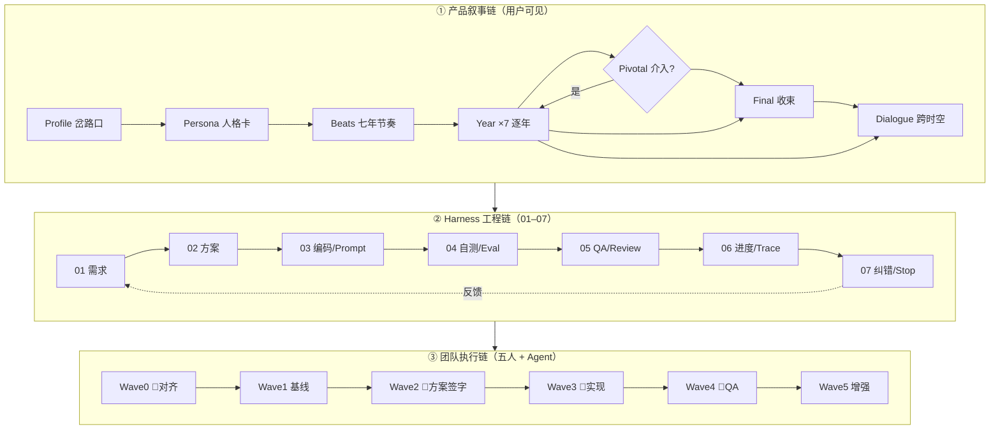

# Shadow 全链路进度看板

> **计划** [`PLAN-2026Q2-shadow-corpus`](./tasks/registry.json) · **更新** 2026-06-14  
> **维护**：改 [`tasks/registry.json`](./tasks/registry.json) 或用 CLI → [`npm run board`](../../package.json) 刷新  
> **排期** → [`04-team-execution-plan.md`](./04-team-execution-plan.md) · **花名册** → [`team-roster.md`](./team-roster.md) · **Visual** → [`../visual/README.md`](../visual/README.md)

---

<!-- TASK-AUTO:START -->
> **自动生成** `2026-06-14 08:05` · 源 [registry.json](./tasks/registry.json) · 可读版 [TASK-LIBRARY.md](./tasks/TASK-LIBRARY.md) · 刷新 `npm run board`

### 图例

| 符号 | 含义 |
|------|------|
| ● | 必做，挡主线 |
| ◇ | 可选，不挡发布 |
| 👤 / 🤖 | 人工 / Agent（CC·Codex） |
| **✓** | 依赖已满足，可立即开始 |
| ~~T-xxx~~ | 已完成的前置依赖 |

### 团队

| 代号 | 角色 |
|------|------|
| **P1** | 产品 / PM |
| **P2** | 叙事 / 内容 |
| **P3** | 工程 Lead |
| **P4** | QA / 评测 |
| **P5** | 工具 / 集成 |

### 快速跳转

| 模块 | 链接 | 模块 | 链接 |
|------|------|------|------|
| 任务库 | [任务库](./tasks/registry.json) | 任务系统说明 | [任务系统说明](./05-task-system.md) |
| 五人排期 | [五人排期](./04-team-execution-plan.md) | Visual 模块 | [Visual 模块](../visual/README.md) |
| 复读线 golden | [复读线 golden](../fixtures/golden-stories/复读线.md) | 叙事待改清单 | [叙事待改清单](../visual/stories/fuxduxian/narrative-gaps.md) |
| 场景 brief | [场景 brief](../visual/stories/fuxduxian/scene-briefs.md) | 素材 CSV | [素材 CSV](../visual/registry/assets.csv) |
| MANIFEST | [MANIFEST](../MANIFEST.md) | AGENTS 入口 | [AGENTS 入口](../AGENTS.md) |

**Changes：** [CHG-000](./changes/CHG-000-corpus-reorg/progress.md) · [CHG-001](./changes/CHG-001-p0-migration/progress.md) · [CHG-V001](./changes/CHG-V001-visual-fuxduxian/progress.md) · [INFRA-001](./changes/INFRA-001-team-onboarding/progress.md)

**Visual：** [CHG-V001](./changes/CHG-V001-visual-fuxduxian/progress.md) · [pipeline](../visual/01-pipeline.md) · [UX 流程](../visual/04-ux-flow.md)

### 统计

| 总计 | 完成 | 进行中 | 阻塞 | **可开干** |
|------|------|--------|------|------------|
| 52 | 44 | 0 | 0 | **6** |

### 阶段概览（任务数）

| [01 需求](../01-requirements/index.md) | [02 方案](../02-technical-design/index.md) | [03 编码](../03-coding/index.md) | [04 自测](../04-dev-testing/index.md) | [05 QA](../05-qa-testing/index.md) | [06 进度](./index.md) | [07 纠错](../07-debug-and-correction/index.md) | [backlog](./tasks/registry.json) |
|---|---|---|---|---|---|---|---|
| 2 | 1 | 1 | 1 | 3 | 0 | 0 | 0 |

### 按 Change 分组（主视图）

#### [INFRA-001](./changes/INFRA-001-team-onboarding/progress.md) — 团队 Onboarding：Kickoff、花名册、Agent 分工、共读 golden

| 状态 | ID | 任务 | 波次 | 阶段 | 负责 | 执行 | 依赖 | 产物 |
|------|-----|------|------|------|------|------|------|------|
| ⬜ **✓** | [T-002](./changes/INFRA-001-team-onboarding/progress.md) | 共读 MANIFEST + 复读线 golden（每人 3 条不可退让） | W0 | 01 需求 | P1 | 👤 | — | [change](./changes/INFRA-001-team-onboarding/progress.md) |

#### [CHG-000](./changes/CHG-000-corpus-reorg/progress.md) — Corpus 整合：唯一入口确认、gap 扫描、skills 基线

| 状态 | ID | 任务 | 波次 | 阶段 | 负责 | 执行 | 依赖 | 产物 |
|------|-----|------|------|------|------|------|------|------|
| ⬜ **✓** | [T-023](./changes/CHG-000-corpus-reorg/progress.md) | P1 确认 corpus 为唯一入口 | W1 | 05 QA | P1 | 👤 | ~~T-005~~ | [progress.md](./changes/CHG-000-corpus-reorg/progress.md) |

#### [CHG-001](./changes/CHG-001-p0-migration/progress.md) — P0 三项迁移：memory 检索 · reflection · intervention re-plan

| 状态 | ID | 任务 | 波次 | 阶段 | 负责 | 执行 | 依赖 | 产物 |
|------|-----|------|------|------|------|------|------|------|
| ⬜ | [T-004](./changes/CHG-001-p0-migration/progress.md) | P1 签字：P0 三项 scope 与顺序 · Gate G0 | W0 | 01 需求 | P1 | 👤 | ~~T-001~~, T-002 | [progress.md](./changes/CHG-001-p0-migration/progress.md) |
| ⬜ **✓** | [T-013](./changes/CHG-001-p0-migration/progress.md) | 方案评审会 + P1/P3 签字 · Gate G2 | W2 | 02 方案 | P1 | 👤 | ~~T-011~~ | [change](./changes/CHG-001-p0-migration/progress.md) |
| ⬜ **✓** | [T-017](./changes/CHG-001-p0-migration/progress.md) | Code Review gate（P0 三项） | W3 | 03 编码 | P3 | 👤 | ~~T-014~~, ~~T-015~~, ~~T-016~~ | [change](./changes/CHG-001-p0-migration/progress.md) |
| ⬜ **✓** | [T-020](./changes/CHG-001-p0-migration/progress.md) | Live 3 条 profile 抽检 · Gate G4 | W4 | 05 QA | P4 | 👤 | ~~T-018~~ | [change](./changes/CHG-001-p0-migration/progress.md) |
| ⬜ | [T-022](./changes/CHG-001-p0-migration/progress.md) | P1 go/no-go 演示签字 · Gate G5 | W4 | 05 QA | P1 | 👤 | ~~T-019~~, T-020 | [change](./changes/CHG-001-p0-migration/progress.md) |

#### [CHG-V001](./changes/CHG-V001-visual-fuxduxian/progress.md) — Visual 复读线：叙事 v2 · 像素素材 · Phaser · 7 年 layout

| 状态 | ID | 任务 | 波次 | 阶段 | 负责 | 执行 | 依赖 | 产物 |
|------|-----|------|------|------|------|------|------|------|
| ⬜ **✓** | [V-008](../fixtures/golden-stories/复读线.json) | 叙事 v2 回写 golden JSON | W3 | 04 自测 | P2 | 👤+🤖 | ~~V-001~~, ~~V-006~~ | [复读线.json](../fixtures/golden-stories/复读线.json) |

### 关键路径 Wave（CHG-001 P0）

| 状态 | ID | 任务 | 波次 | 阶段 | 负责 | 执行 | 依赖 | 产物 |
|------|-----|------|------|------|------|------|------|------|
| ⬜ | [T-004](./changes/CHG-001-p0-migration/progress.md) | P1 签字：P0 三项 scope 与顺序 · Gate G0 | W0 | 01 需求 | P1 | 👤 | ~~T-001~~, T-002 | [progress.md](./changes/CHG-001-p0-migration/progress.md) |
| ✅ | [T-010](../03-coding/01-narrative-prompt-protocol.md) | P0 需求写入 02/03 文档 | W2 | 01 需求 | P2 | 👤 | T-004, ~~T-007~~ | [01-narrative-prompt-protocol.md](../03-coding/01-narrative-prompt-protocol.md) |
| ✅ | [T-011](../02-technical-design/02-p0-memory-reflection-replan.md) | P0 技术方案文档 · Gate G2 | W2 | 02 方案 | P3 | 🤖CC | ~~T-010~~ | [02-p0-memory-reflection-replan.md](../02-technical-design/02-p0-memory-reflection-replan.md) |
| ✅ | [T-012](../docs/plans/2026-06-14-p0-implementation.md) | P0 实现计划（writing-plans） | W2 | 02 方案 | P3 | 🤖CC | ~~T-011~~ | [2026-06-14-p0-implementation.md](../docs/plans/2026-06-14-p0-implementation.md) |
| ⬜ **✓** | [T-013](./changes/CHG-001-p0-migration/progress.md) | 方案评审会 + P1/P3 签字 · Gate G2 | W2 | 02 方案 | P1 | 👤 | ~~T-011~~ | [change](./changes/CHG-001-p0-migration/progress.md) |
| ✅ | [T-014](../archive/demo-v0.2/lib/) | 实现 memory 检索 | W3 | 03 编码 | P3 | 🤖CX | ~~T-012~~, T-013 | [lib](../archive/demo-v0.2/lib/) |
| ✅ | [T-015](../archive/demo-v0.2/lib/) | 实现 reflection 步骤 | W3 | 03 编码 | P3 | 🤖CX | ~~T-012~~, T-013 | [lib](../archive/demo-v0.2/lib/) |
| ✅ | [T-016](../archive/demo-v0.2/lib/prompts.js) | intervention re-plan prompt（人写）+ Codex 接线 · Gate G1 | W3 | 03 编码 | P2 | 👤+🤖 | ~~T-012~~, T-013, ~~T-010~~ | [prompts.js](../archive/demo-v0.2/lib/prompts.js) |
| ⬜ **✓** | [T-017](./changes/CHG-001-p0-migration/progress.md) | Code Review gate（P0 三项） | W3 | 03 编码 | P3 | 👤 | ~~T-014~~, ~~T-015~~, ~~T-016~~ | [change](./changes/CHG-001-p0-migration/progress.md) |
| ✅ | [T-018](./changes/CHG-001-p0-migration/progress.md) | 合并 + npm test 全绿 · Gate G3 | W3 | 04 自测 | P5 | 🤖CX | T-017 | [change](./changes/CHG-001-p0-migration/progress.md) |
| ✅ | [T-019](../fixtures/golden-stories/复读线.json) | Golden 复读线 eval 回归 | W4 | 04 自测 | P4 | 🤖CX | ~~T-018~~ | [复读线.json](../fixtures/golden-stories/复读线.json) |
| ⬜ **✓** | [T-020](./changes/CHG-001-p0-migration/progress.md) | Live 3 条 profile 抽检 · Gate G4 | W4 | 05 QA | P4 | 👤 | ~~T-018~~ | [change](./changes/CHG-001-p0-migration/progress.md) |
| ⬜ | [T-022](./changes/CHG-001-p0-migration/progress.md) | P1 go/no-go 演示签字 · Gate G5 | W4 | 05 QA | P1 | 👤 | ~~T-019~~, T-020 | [change](./changes/CHG-001-p0-migration/progress.md) |

### 立即可执行（6 项 · deps 已满足）

| 状态 | ID | 任务 | 波次 | 阶段 | 负责 | 执行 | 依赖 | 产物 |
|------|-----|------|------|------|------|------|------|------|
| ⬜ **✓** | [T-002](./changes/INFRA-001-team-onboarding/progress.md) | 共读 MANIFEST + 复读线 golden（每人 3 条不可退让） | W0 | 01 需求 | P1 | 👤 | — | [change](./changes/INFRA-001-team-onboarding/progress.md) |
| ⬜ **✓** | [T-023](./changes/CHG-000-corpus-reorg/progress.md) | P1 确认 corpus 为唯一入口 | W1 | 05 QA | P1 | 👤 | ~~T-005~~ | [progress.md](./changes/CHG-000-corpus-reorg/progress.md) |
| ⬜ **✓** | [T-013](./changes/CHG-001-p0-migration/progress.md) | 方案评审会 + P1/P3 签字 · Gate G2 | W2 | 02 方案 | P1 | 👤 | ~~T-011~~ | [change](./changes/CHG-001-p0-migration/progress.md) |
| ⬜ **✓** | [T-017](./changes/CHG-001-p0-migration/progress.md) | Code Review gate（P0 三项） | W3 | 03 编码 | P3 | 👤 | ~~T-014~~, ~~T-015~~, ~~T-016~~ | [change](./changes/CHG-001-p0-migration/progress.md) |
| ⬜ **✓** | [V-008](../fixtures/golden-stories/复读线.json) | 叙事 v2 回写 golden JSON | W3 | 04 自测 | P2 | 👤+🤖 | ~~V-001~~, ~~V-006~~ | [复读线.json](../fixtures/golden-stories/复读线.json) |
| ⬜ **✓** | [T-020](./changes/CHG-001-p0-migration/progress.md) | Live 3 条 profile 抽检 · Gate G4 | W4 | 05 QA | P4 | 👤 | ~~T-018~~ | [change](./changes/CHG-001-p0-migration/progress.md) |

### 进行中

_无_

### 阻塞

_无_

### 按人负载

| 成员 | 角色 | todo | 进行中 | 可开干 | 等待池 | CLI |
|------|------|------|--------|--------|--------|-----|
| **P1** | 产品 / PM | 5 | 0 | 3 | 0 | `mine P1` |
| **P2** | 叙事 / 内容 | 1 | 0 | 1 | 0 | `mine P2` |
| **P3** | 工程 Lead | 1 | 0 | 1 | 0 | `mine P3` |
| **P4** | QA / 评测 | 1 | 0 | 1 | 0 | `mine P4` |
| **P5** | 工具 / 集成 | 0 | 0 | 0 | 0 | `mine P5` |

### Gates（人工签字点）

| Gate | 名称 | 负责人 | 解锁 |
|------|------|--------|------|
| **G0** | P0 scope 签字 | P1 | 02-design for CHG-001 |
| **G1** | 叙事口径 | P2 | 03-coding prompts |
| **G2** | 技术方案 | P3+P1 | writing-plans；Codex |
| **G3** | Eval 绿 | P4 | 05-qa live |
| **G4** | 叙事质量 | P4+P2 | go/no-go |
| **G5** | 发布演示 | P1 | 对外 demo |
| **G-N1** | 复读线叙事 v2 签字 | P2 | visual AI 布局批量 |

### CLI 速查

```bash
npm run tasks -- ready              # 可立即开始的任务
npm run tasks -- mine P2            # 某成员任务 + 等待池
npm run tasks -- list --change CHG-001   # 按 Change 筛选
npm run tasks -- critical           # 关键路径
npm run tasks -- show T-007         # 单任务详情
npm run board                       # 刷新看板 + 任务库
```
<!-- TASK-AUTO:END -->

## 0. 全链路一图（三层）



**读法：** 上层是「用户得到什么」；中层是「文档 + 代码 + Skill 怎么约束」；下层是「谁什么时候做」。

---

## 1. 图例

| 符号 | 含义 |
|------|------|
| 👤 | 仅人 / 必须人签字 |
| 🤖CC | Claude Code session |
| 🤖CX | Codex executing-plans |
| ⏳ | Agent/API 等待期可并行 |
| ✅ / 🟡 / ⬜ | 完成 / 进行中 / 未开始 |
| 🔴 | 阻塞 |
| **●** | **必做** — 关键路径，不做挡主线 |
| **◇** | **可选** — 增强/填充，可跳过或后做 |

### 可选功能（不做不挡第一期）

| 标记 | 功能 | 说明 | 链接 |
|------|------|------|------|
| ◇ | 等待池 W-xx | Agent 长跑时填充 | [registry](./tasks/registry.json) `--tag waiting-pool` |
| ◇ | 归档 demo 运行 | 对照契约用 | [demo](../archive/demo-v0.2/) |
| ◇ | Visual **C 类**短片 | quiet 年可只做 B+A | [UX 流程](../visual/04-ux-flow.md) |
| ◇ | AI 生成像素入库 | 仅补缺，非主库 | [pipeline](../visual/01-pipeline.md) |
| ◇ | CHG-002～006 | Wave5 增强 | [路线图](../knowledge/research/migration-roadmap-p0-p3.md) |
| ◇ | progress.md 单 change | 多线并行时才需要 | [规范](./03-progress-file.md) |
| ◇ | P3 Beats 关系图 | 低优可视化 | backlog CHG-006 |

**第一期必做（●）：** [INFRA-001](./changes/INFRA-001-team-onboarding/progress.md) · [CHG-001](./changes/CHG-001-p0-migration/progress.md) · [CHG-V001](./changes/CHG-V001-visual-fuxduxian/progress.md) · [CHG-000 收尾](./changes/CHG-000-corpus-reorg/progress.md)

| 阶段列 | 对应目录 | 首选 Skill |
|--------|----------|------------|
| 01 需求 | [`01-requirements/`](../01-requirements/) | [`brainstorming`](../skills/pool/brainstorming/SKILL.md) |
| 02 方案 | [`02-technical-design/`](../02-technical-design/) | [`design-generator`](../skills/harness/design-generator/SKILL.md) · [框架图](../02-technical-design/00-harness-framework-diagram.md) |
| 03 编码 | [`03-coding/`](../03-coding/) | [`tdd`](../skills/pool/tdd/SKILL.md) |
| 04 自测 | [`04-dev-testing/`](../04-dev-testing/) | tdd, [`story-authoring`](../skills/shadow/story-authoring/SKILL.md) |
| 05 QA | [`05-qa-testing/`](../05-qa-testing/) | [`story-review`](../skills/shadow/story-review/SKILL.md) |
| 06 进度 | [`06-task-progress/`](./) | [`progress-tracker`](../skills/harness/progress-tracker/SKILL.md) |
| 07 纠错 | [`07-debug-and-correction/`](../07-debug-and-correction/) | [`systematic-debugging`](../skills/pool/systematic-debugging/SKILL.md) |
| Visual | [`visual/`](../visual/) | — |
| Done | [`MANIFEST`](../MANIFEST.md) | [`verification-before-completion`](../skills/pool/verification-before-completion/SKILL.md) |

---

## 2. Harness 六要素健康度

闭环文档：[`02-technical-design/01-shadow-harness-loop.md`](../02-technical-design/01-shadow-harness-loop.md)

| 要素 | 状态 | 当前焦点 | 负责人 |
|------|------|----------|--------|
| **Goal** 目标与验收 | 🟡 | P0 三项待 P1 签字扩 scope | P1 |
| **Actor** 5-agent 管线 | 🟡 | Reflection / re-plan 未实现 | P3 |
| **Environment** 运行与契约 | ✅ | Corpus + 归档 demo 可跑 | P5 |
| **Feedback** Schema + Eval | ✅ | golden 7/7；live warn 待人审 | P4 |
| **Memory** 记忆与追溯 | 🟡 | 全量传递 → 待 P0 检索 | P3 |
| **Stop** 停止与升级 | ✅ | 07 文档已有；敏感路径待演练 | P4 |

---

## 3. 主看板（七阶段 + Done）

### 3.1 泳道总览

| 01 需求 | 02 方案 | 03 编码 | 04 自测 | 05 QA | 06 进度 | 07 纠错 | Done |
|---------|---------|---------|---------|-------|---------|---------|------|
| CHG-001 P0 | — | — | CHG-000 | — | PLAN 看板 | — | 01–07 基线文档 |
| CHG-002 第二golden | CHG-001 待进 | CHG-001 待进 | CHG-000 test | CHG-001 待进 | CHG-000 trace规范 | — | 81 skills |
| Wave0 kickoff | P0 design 待写 | — | npm 7/7 | story-review表 | 实验日志 | Stop 演练 | demo 归档 |
| (P1+P2) | (P3) | (P3+CX) | (P4+P5) | (P4) | (P5) | (P4) | (P5) |

**Totals:** 01=2 · 02=1 · 03=0 · 04=1 · 05=0 · 06=1 · 07=0 · Done=3（基线项）  
**Blocked:** 0  
**下一关键路径:** Wave0 👤 → CHG-001 进 02 → writing-plans → 03

### 3.2 按 Change 定位

| ID | 标题 | 当前列 | Assignee | 下一 Gate |
|----|------|--------|----------|-----------|
| [CHG-000](./changes/CHG-000-corpus-reorg/progress.md) | Corpus 统筹 | **04 自测** | P5 | P1 确认入口 👤 |
| [CHG-001](./changes/CHG-001-p0-migration/progress.md) | P0 迁移 | **01 需求** | P3/P2/P4 | P1+P2 口径 👤 |
| [CHG-V001](./changes/CHG-V001-visual-fuxduxian/progress.md) | 复读线 Visual | **01 需求** | P2/P5 | [G-N1 叙事 v2](../visual/stories/fuxduxian/narrative-gaps.md) |
| CHG-002 | 第二条 golden | backlog | P2 | CHG-001 后 |
| CHG-003 | 多 run 对比 | backlog | P4 | CHG-001 后 |
| [INFRA-001](./changes/INFRA-001-team-onboarding/progress.md) | 五人协作 | **01 进行中** | P1 | [team-roster](./team-roster.md) |

---

## 4. 产品叙事链进度（L1）

| 环节 | 文档/代码 | 状态 | 缺口 |
|------|-----------|------|------|
| Profile | [`01-shadow-product-requirements.md`](../01-requirements/01-shadow-product-requirements.md) | ✅ | — |
| Persona | [`narrative-prompt-protocol`](../03-coding/01-narrative-prompt-protocol.md) | 🟡 | Prompt 未收敛 |
| Beats | 同上 + eval | ✅ | re-plan 未实现 |
| Year×7 | [`intervention-requirements`](../01-requirements/02-intervention-requirements.md) | ✅ | beat 更新未实现 |
| Final | [`复读线 golden`](../fixtures/golden-stories/复读线.md) | 🟡 | **文案待 v2** |
| Dialogue | [`story-review`](../skills/shadow/story-review/SKILL.md) | 🟡 | 对照表待做 |
| Live API | [`demo server`](../archive/demo-v0.2/server.js) | ✅ | 归档 |
| **Visual** | [`visual/fuxduxian`](../visual/stories/fuxduxian/scene-briefs.md) | 🟡 | 等叙事 v2 |
| Memory 检索 | P0 | ⬜ | — |
| Reflection | P0 | ⬜ | — |

---

## 5. 语料库就绪度（L2 · 01–07）

| 阶段 | 目录 | 文档 | Skill | 夹具/代码 | 总评 |
|------|------|------|-------|-----------|------|
| 01 | [`01-requirements/`](../01-requirements/) | ✅ 3 篇 | brainstorming | golden 引用 | ✅ |
| 02 | [`02-technical-design/`](../02-technical-design/) | 🟡 缺 P0 专篇 | design-generator | 契约在 archive | 🟡 |
| 03 | [`03-coding/`](../03-coding/) | ✅ 协议 | tdd | prompts 在 archive | 🟡 |
| 04 | [`04-dev-testing/`](../04-dev-testing/) | ✅ rubric | tdd | golden + test 7/7 | ✅ |
| 05 | [`05-qa-testing/`](../05-qa-testing/) | ✅ | story-review | E2E 场景 | 🟡 缺跑批 |
| 06 | [`06-task-progress/`](../06-task-progress/) | ✅ 本看板 | progress-tracker | runs 规范 | 🟡 |
| 07 | [`07-debug-and-correction/`](../07-debug-and-correction/) | ✅ Stop 文档 | systematic-debugging | 未演练 | 🟡 |

**Skill 池：** [81 个](../skills/) · [sync 脚本](../skills/sync-cursor-links.sh)  
**Hooks：** [tooling/hooks/](../tooling/hooks/) · [claude-settings](../tooling/claude-settings.json)  
**Visual：** [README](../visual/README.md) · [assets.csv](../visual/registry/assets.csv)

---

## 6. 变更全链路卡（Artifact 清单）

### CHG-001 — P0 能力迁移 · `requirements`

| 链路段 | 产物 | 状态 | 执行 |
|--------|------|------|------|
| 01 需求摘要 | P1 scope 签字 + P2 红线清单 | ⬜ | 👤 |
| 02 方案 | `02-technical-design/02-p0-*.md` | ⬜ | 🤖CC design-generator → 👤 P3 |
| 03 计划 | `docs/plans/2026-06-14-p0-implementation.md` | ⬜ | 🤖CC writing-plans |
| 03 协议 | 更新 narrative-prompt-protocol | ⬜ | 👤 P2 + 🤖 |
| 03 代码 | memory / reflection / re-plan in lib | ⬜ | 🤖CX executing-plans |
| 04 自测 | npm test + golden | ⬜ | 🤖CX tdd |
| 05 QA | story-review 3 live | ⬜ | 👤 P4 |
| 06 进度 | progress.md → done | 🟡 | P5 |
| 07 纠错 | eval error 走 07 流程 | ⬜ | 按需 |

→ [`changes/CHG-001-p0-migration/progress.md`](./changes/CHG-001-p0-migration/progress.md)

---

### CHG-000 — Corpus 统筹 · `dev-testing`

| 链路段 | 产物 | 状态 |
|--------|------|------|
| 01–07 迁入 | shadow-corpus 结构 | ✅ |
| Skill 迁移 | pool 75 + shadow 5 + router | ✅ |
| 04 自测 | npm test 7/7 | ✅ |
| 06 看板 | BOARD.md（本文件） | 🟡 持续 |
| Done gate | P1 确认唯一入口 | ⬜ 👤 |

→ [`changes/CHG-000-corpus-reorg/progress.md`](./changes/CHG-000-corpus-reorg/progress.md)

---

### [CHG-V001](../visual/README.md) — Visual 第一期 · `requirements`

| 链路段 | 产物 | 状态 |
|--------|------|------|
| 叙事 v2 | [narrative-gaps](../visual/stories/fuxduxian/narrative-gaps.md) → draft-v2 | ⬜ 👤 |
| 寻源 | [assets.csv](../visual/registry/assets.csv) | ⬜ |
| 标杆 | [aesthetic-cases](../visual/references/aesthetic-cases.md) | ⬜ |
| 布局 | [scenes/fuxduxian/](../visual/scenes/fuxduxian/) | ⬜ |
| 引擎 | [engine/](../visual/engine/) | ⬜ |

→ [progress.md](./changes/CHG-V001-visual-fuxduxian/progress.md)

---

### Backlog

| ID | 优先级 | 标题 | 依赖 | 目标列 |
|----|--------|------|------|--------|
| CHG-002 | P1 内容 | 第二条 golden（大纲→JSON） | CHG-001 | 01→04 |
| CHG-003 | P1 评估 | 多 run 对比模板 + 首表 | CHG-001 | 06 |
| CHG-004 | P1 评估 | story-review trace 检查项 | CHG-003 | 05 |
| CHG-005 | P2 自动化 | Post-final report + hook | CHG-004 | 05→06 |
| CHG-006 | P3 可选 | Beats 关系图 / canvas | 低优 | 02 |

路线图：[`knowledge/research/migration-roadmap-p0-p3.md`](../knowledge/research/migration-roadmap-p0-p3.md)

---

## 7. 团队 Wave 与人工 Gate

| Wave | 日历 | 状态 | 通过标准 | 阻塞项 |
|------|------|------|----------|--------|
| **0** 对齐 | D1 上午 | ⏳ | [roster](./team-roster.md) + G0 | roster 未填 |
| **1** 基线 | D1 下午 | 🟡 | test 绿 + 红线 + rubric 对齐 | 人审 1.3/1.4 |
| **2** 方案 | D2 | ⬜ | P0 方案 👤 + plans 文件 | 依赖 Wave0 |
| **3** 实现 | D3–5 | ⬜ | 3 PR + P3 review | 依赖 Wave2 |
| **4** QA | D6 | ⬜ | story-review + go/no-go | 依赖 Wave3 |
| **5** 增强 | D7+ | ⬜ | CHG-003/002 择一启动 | 依赖 Wave4 |

### 人工 Gate（不可跳过）

| Gate | 谁签字 | 解锁什么 |
|------|--------|----------|
| G0 | [P1](./team-roster.md) | [CHG-001](./changes/CHG-001-p0-migration/progress.md) 进 02 |
| G1 | P2 | [Prompt 协议](../03-coding/01-narrative-prompt-protocol.md) |
| G2 | P3+P1 | writing-plans / Codex |
| G-N1 | P2 | [Visual 布局](../visual/01-pipeline.md) 批量 |
| G3 | P4 | QA live |
| G4 | P4+P2 | go/no-go |
| G5 | P1 | 对外 demo |

---

## 8. Agent 任务队列

| 序 | 任务 | 工具 | 状态 | 输入 | Done when |
|----|------|------|------|------|-----------|
| A1 | Corpus gap 扫描 | 🤖CC harness-init | ⬜ | MANIFEST | gap 清单 |
| A2 | P0 技术方案 | 🤖CC design-generator | ⬜ | G0 过 | 02-p0-*.md |
| A3 | P0 实现计划 | 🤖CC writing-plans | ⬜ | G2 过 | plans/*.md |
| A4 | memory 检索 | 🤖CX executing-plans | ⬜ | A3 | test 绿 |
| A5 | reflection | 🤖CX ∥ A4 | ⬜ | A3 | test 绿 |
| A6 | re-plan 接线 | 🤖CX + 👤 P2 prompt | ⬜ | A3 | test 绿 |

**派单模板** → 执行计划 §7

---

## 9. 五人负载快照

| 成员 | 本周主责 | 进行中 | ⏳ 等待池 |
|------|----------|--------|-----------|
| **P1** PM | Wave0 kickoff、G0/G5 | INFRA-001 | W-07 话术、W-11 FAQ |
| **P2** 叙事 | 红线清单、Prompt | CHG-002 大纲 | W-01~03, W-09 |
| **P3** 工程 | CHG-001、Agent 派单 | A2–A6 排期 | Review gate |
| **P4** QA | rubric 对齐、抽检表 | CHG-000 签字辅助 | W-04, W-10 |
| **P5** 工具 | CHG-000 收尾、sync | BOARD 维护 | W-06, W-08 |

---

## 10. 等待池（Agent/API 长跑时）

| ID | 任务 | 负责 | 跳转 |
|----|------|------|------|
| [W-01](./tasks/registry.json) | Persona prompt ×3 | P2 | [实验日志](./02-prompt-experiments-log.md) |
| [W-02](./tasks/registry.json) | Beats 示例 ×2 | P2 | — |
| [W-03](./tasks/registry.json) | Dialogue 对照 | P2 | — |
| [W-04](./tasks/registry.json) | story-review 表 | P4 | [story-review](../skills/shadow/story-review/SKILL.md) |
| [W-06](./tasks/registry.json) | skills sync | P5 | [sync 脚本](../skills/sync-cursor-links.sh) |
| [W-07](./tasks/registry.json) | 5min 话术 | P1 | — |
| [W-10](./tasks/registry.json) | warn 决策树 | P4 | [eval rubric](../04-dev-testing/01-narrative-eval-rubric.md) |
| [V-001](./changes/CHG-V001-visual-fuxduxian/progress.md) | 叙事 v2 | P2 | [narrative-gaps](../visual/stories/fuxduxian/narrative-gaps.md) |
| [V-002](./changes/CHG-V001-visual-fuxduxian/progress.md) | 素材寻源 | P5 | [assets.csv](../visual/registry/assets.csv) |

---

## 11. 决策与开放问题

| # | 问题 | 选项 | 决策人 | 状态 |
|---|------|------|--------|------|
| D1 | P0 是否必改 archive demo 代码？ | 仅文档 / 文档+lib | P1+P3 | ⬜ 待 Wave0 |
| D2 | 第二条 golden 主题 | 待 P2 提案 | P1+P2 | ⬜ |
| D3 | Live 跑批用哪个 model 作基线 | env 配置 | P3+P5 | ⬜ |
| D4 | CC vs Codex 分支策略 | main / worktree | P3 | ⬜ |

---

## 12. 风险登记

| 风险 | 影响 | 缓解 | 负责人 |
|------|------|------|--------|
| Agent 改 prompt 未经 P2 | 叙事口径漂移 | 03 变更必须实验日志 👤 | P2 |
| 五人缺 roster | 派单混乱 | Wave0 第一件事 | P1 |
| API 限流拖 live QA | Wave4 延期 | 等待期 W-01–04；非高峰批跑 | P5 |
| P0 三项耦合同 PR | Review 困难 | 垂直切片 3 PR | P3 |

---

## 13. 本周优先级（Top 5）

1. 👤 [Wave0](./changes/INFRA-001-team-onboarding/progress.md) — [roster](./team-roster.md) + G0  
2. 👤 [T-007](./tasks/registry.json) + [T-008](./tasks/registry.json) — 红线 + rubric  
3. 👤 [V-001](../visual/stories/fuxduxian/narrative-gaps.md) — 复读线叙事 v2  
4. 🤖CC [T-011](./changes/CHG-001-p0-migration/progress.md) — P0 方案（G0 后）  
5. ⏳ [W-01](./02-prompt-experiments-log.md) / [W-04](../skills/shadow/story-review/SKILL.md) / [W-06](../skills/sync-cursor-links.sh)

---

## 14. 快速链接

| 用途 | 链接 |
|------|------|
| Agent 入口 | [AGENTS.md](../AGENTS.md) |
| 全目录 | [MANIFEST.md](../MANIFEST.md) |
| Golden | [复读线.md](../fixtures/golden-stories/复读线.md) |
| Prompt 实验 | [02-prompt-experiments-log.md](./02-prompt-experiments-log.md) |
| Skill 路由 | [shadow-router](../skills/shadow-router/SKILL.md) |
| 任务系统 | [05-task-system.md](./05-task-system.md) |
| 任务库 | [registry.json](./tasks/registry.json) |
| Visual | [visual/README.md](../visual/README.md) |
| 叙事待改 | [narrative-gaps.md](../visual/stories/fuxduxian/narrative-gaps.md) |
| 研究 | [migration-roadmap](../knowledge/research/migration-roadmap-p0-p3.md) |

---

*看板版本 v2 · 覆盖产品链 + Harness 链 + 团队链*
